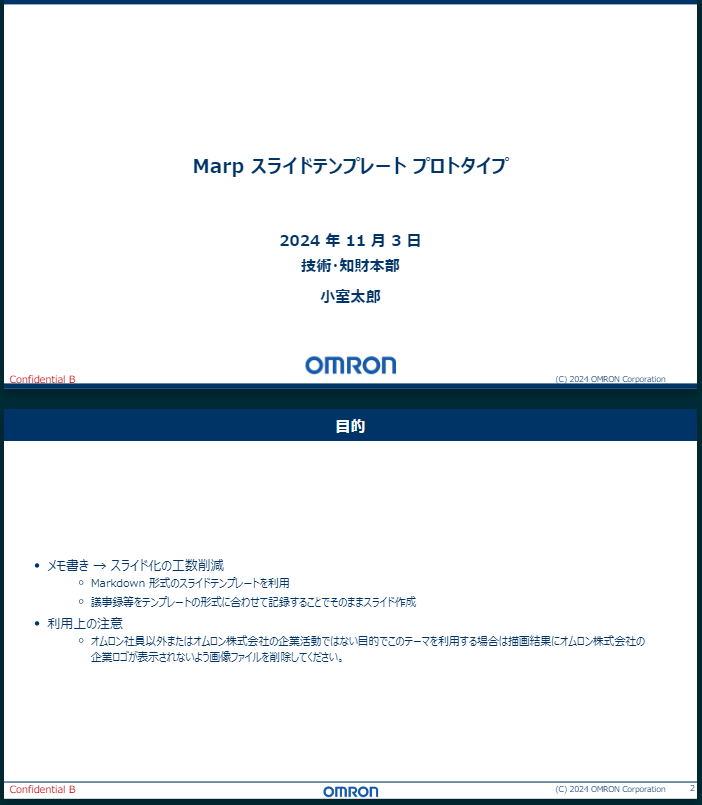
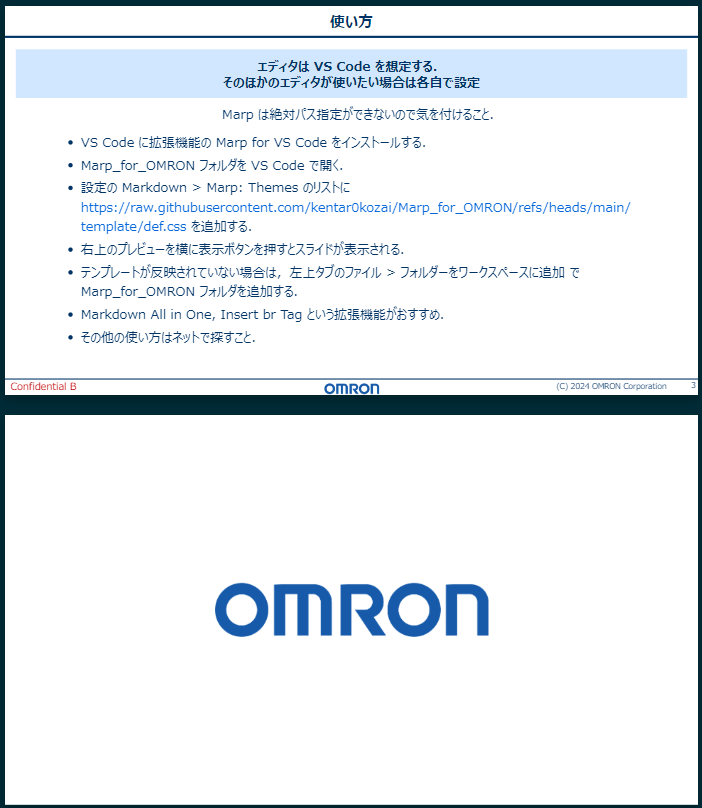

<!-- 1枚目 -->
<!-- class: top-page -->

# Marp スライドテンプレート v3

## 2024 年 11 月 3 日

### 技術・知財本部

### 小室太郎

---

<!-- class: second-page -->

# 目的

- メモ書き → スライド化の工数削減
  - Markdown 形式のスライドテンプレートを利用
  - 議事録等をテンプレートの形式に合わせて記録することでそのままスライド作成
- 利用上の注意
  - オムロン社員以外またはオムロン株式会社の企業活動ではない目的でこのテーマを利用する場合は描画結果にオムロン株式会社の企業ロゴが表示されないよう画像ファイルを削除してください。

---

<!-- class: slide -->

# 使い方

## エディタは VS Code を想定する． そのほかのエディタが使いたい場合は各自で設定

Marp は絶対パス指定ができないので気を付けること．

- VS Code に拡張機能の Marp for VS Code をインストールする．
- Marp_for_OMRON フォルダを VS Code で開く．
- 設定の Markdown > Marp: Themes のリストに https://raw.githubusercontent.com/kentar0kozai/Marp_for_OMRON/refs/heads/main/template/def.css を追加する．
- 右上のプレビューを横に表示ボタンを押すとスライドが表示される．
- テンプレートが反映されていない場合は，左上タブのファイル > フォルダーをワークスペースに追加 で Marp_for_OMRON フォルダを追加する．
- Markdown All in One, Insert br Tag という拡張機能がおすすめ．
- その他の使い方はネットで探すこと．
   

---

<!-- class: slide -->

---

<!-- class: end -->
